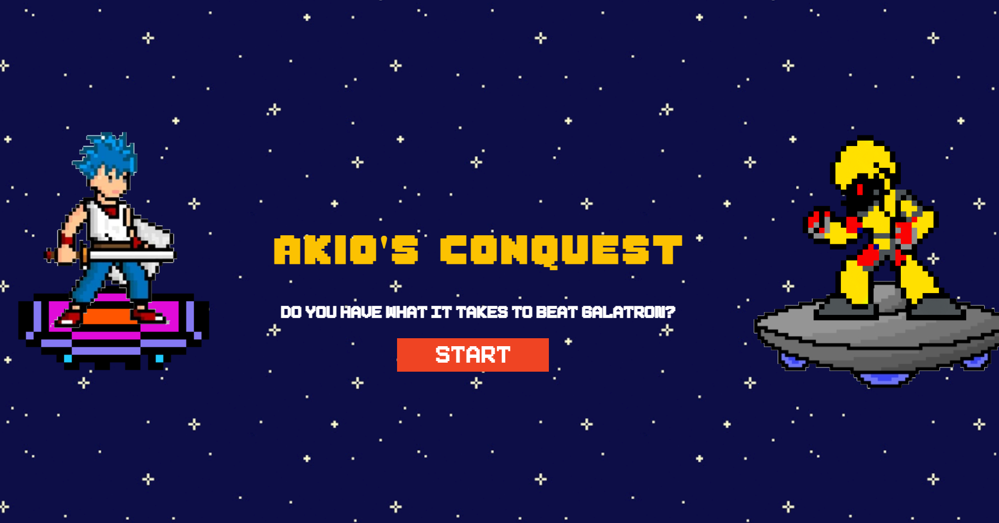
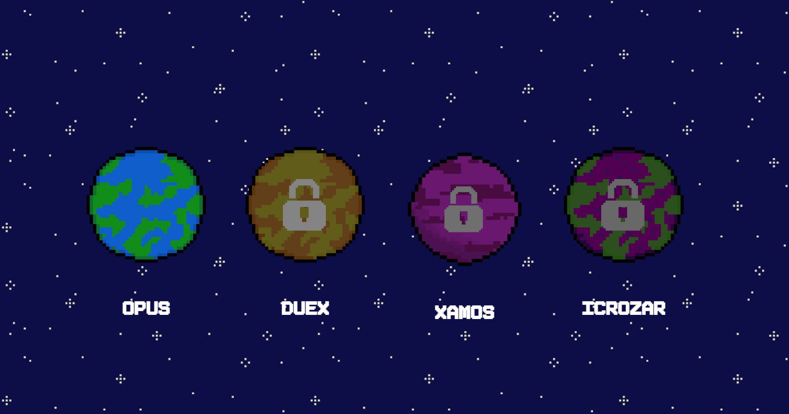
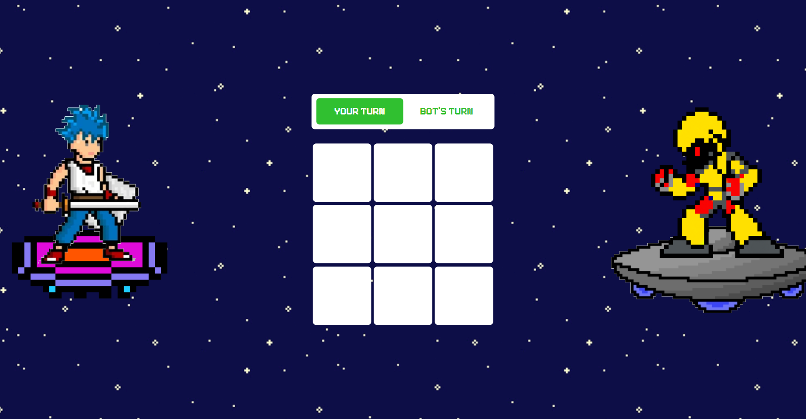
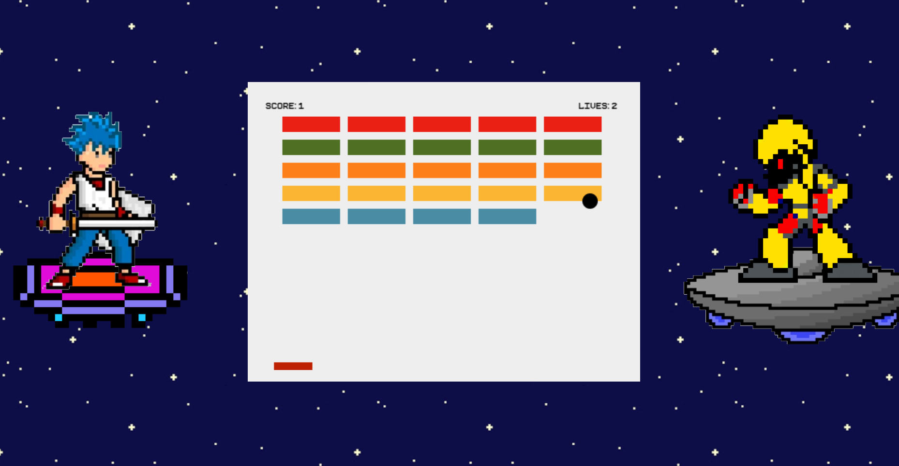
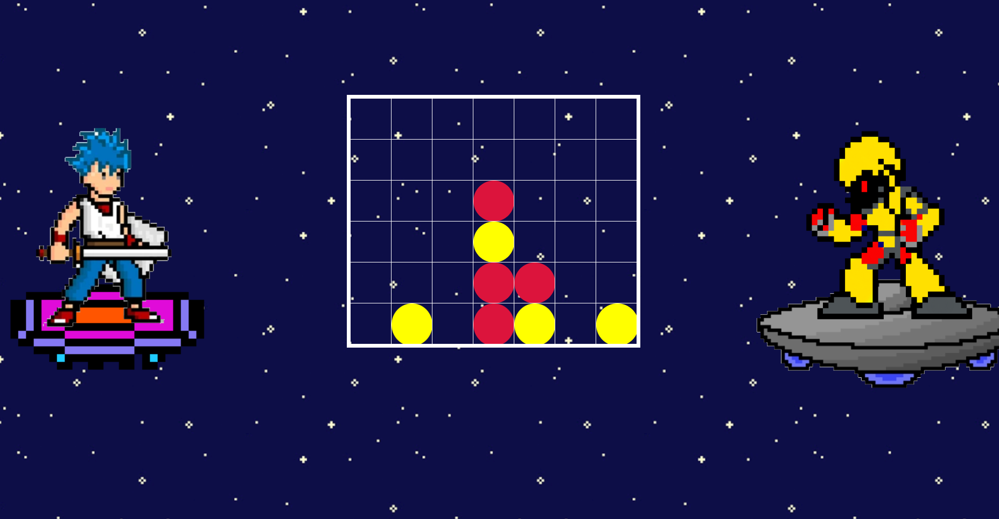
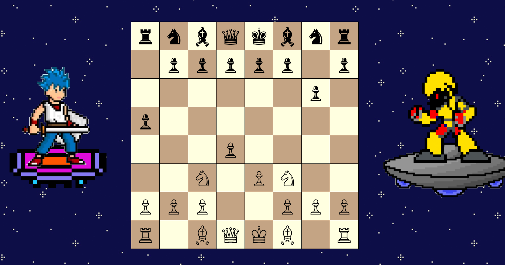
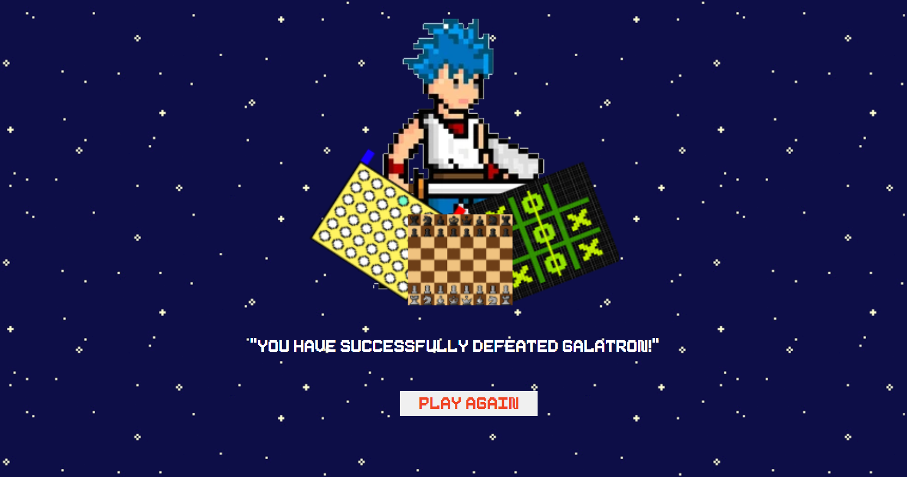

<h3>Table of Contents</h3>
<ul>
    <li><a href="#introduction">Introduction</a></li>
    <li><a href="#overview">Overview</a></li>
    <li><a href="#implementation">Implementation</a></li>
    <li><a href="#installation-and-setup">Installation and Setup</a></li>
    <li><a href="#usage">Usage</a></li>
    <li><a href="#future-work">Future Work</a></li>
    <li><a href="#team">Team</a></li>
</ul>

<h3 id="introduction">Introduction</h3>

   Once upon a time, in a small village, an unwelcome visitor arrived - <b>Galatron</b>, a formidable extraterrestrial robot. With a strong grip, he seized the village's most cherished treasures - their beloved board games. As sadness engulfed the village, a brave hero emerged from the shadows – <b>Akio</b>, a warrior determined to go on a noble mission. His goal? To reclaim the stolen games from the clutches of Galatron. To achieve this daring feat, Akio must outwit Galatron in four games scattered across different planets: <b>Xamos, Opus, Icrozar and Duex</b>. With each victory, he inches closer to restoring joy to his village. Can Akio muster the courage to triumph over Galatron and restore the cherished games to their rightful place? Only time will unveil the outcome of this epic expedition.

 

<table>
   <tr>
      
   </tr>
</table>

<h3 id="overview">Overview</h3>
<b>Akio's Conquest</b> is a web application developed for submission to the <b>Snakes and Hackers II</b> Hackathon organized by MLH, where it bagged the <B>First Prize</b>. It provides users with an opportunity to engage in an immersive gaming experience, featuring the traditionals <b>Tic Tac Toe, Breakout, Connect-4 and Chess</b> with increasing complexities as you progress through each game.
  
<table>
   <tr>
      
   </tr>
</table>

<h3 id="implementation">Implementation</h3>

   The conquest features four games which are crafted using fundamental web development technologies, specifically <b>HTML, CSS, JavaScript and jQuery</b>. In the case of <b>Tic Tac Toe</b>, the bot's moves are generated with a more random approach, making the gameplay straightforward and less predictable. This randomness adds an element of enjoyment for beginners, as the bot's strategy is not always optimal, resulting in a more varied and relaxed gaming experience.  

   On the other hand, <b>Connect-4 and Chess</b> employ a more sophisticated strategy to elevate the gameplay. Both games leverage the <b>Minimax Algorithm (Alpha - Beta Pruning)</b>, a decision-making algorithm tailored for determining the best possible move for the current player. This algorithm operates under the assumption that the opponent will also make optimal moves, thus seeking to minimize the maximum potential loss. This strategic depth creates a challenging environment for players as the bot's moves are meticulously calculated to maximize its chances of winning.

<table>
   <tr>
      <td>
         
<b>Tic Tac Toe</b>

          
         
      </td>
      <td>
         
<b>Breakout</b>

          
         
      </td>
   </tr>
   <tr>
      <td>
         
<b>Connect 4</b>

          
         
      </td>
      <td>
         
<b>Chess</b>

          
         
      </td>
   </tr>
</table>

   <h4>Minmax Algorithm (Alpha - Beta Pruning)</h4>
   

      The Minimax Algorithm is a renowned decision-making technique employed in two-player games. It systematically traverses the <b>game tree</b>, assessing potential moves until reaching <b>terminal states</b> like victory, defeat, or draw. At these endpoints, it assigns <b>scores</b> to denote the outcome for each player. The algorithm prioritizes selecting the move that maximizes the outcome for one player while minimizing it for the opponent. This strategic approach enables optimal decision-making by meticulously considering potential future outcomes.
   

    
   

      Minimax, at its essence, seeks to maximize the player's winning prospects while minimizing the opponent's. However navigating through the exhaustive game tree can incur substantial computational costs, notably in intricate games such as chess. Enter <b>alpha-beta pruning</b>, a clever optimization strategy. By <b>selectively trimming branches of the game tree</b> that offer inferior outcomes, alpha-beta pruning markedly <b>shrinks the search space</b> without sacrificing the algorithm's performance. This refined method upholds the Minmax's fundamental principles while enhancing its performance, resulting in a much faster and more nuanced decision-making within strategic gaming environments.
   

    
   

      For more information, please refer to <a href="https://www.geeksforgeeks.org/minimax-algorithm-in-game-theory-set-4-alpha-beta-pruning">Minimax Algorithm in Game Theory | Set 4 (Alpha-Beta Pruning)</a>
   

 

   Once you has won all the games and proven your mettle against Galatron on each planet, you will be greeted with the following page.  

<h3 id="installation-and-setup">Installation and Setup</h3>
<ul>
   <li>
      Clone the repository using the command:
      <code>git clone https://github.com/asood-life/akios-conquest.git</code>
   </li>
   <li>
      Navigate to the project : 
      <code>cd akios-conquest</code> and 
      open <code>index.html</code> in browser to get started.
   </li>
</ul>

<h3 id="usage">Usage</h3>
<ul>
   <li>Access the web application using the following link: <a href="https://asood-life.github.io/akios-conquest">https://asood-life.github.io/akios-conquest</a>.
   </li>
   <li>
      Click the <b>START</b> button on the home page to begin the expedition. Click on <b>Opus</b>, where you will face Galatron in a game of <b>Tic Tac Toe</b>.
   </li>
   <li> 
      Once you win in Tic Tac Toe, progress to the next planets <b>Duex, Xamos, and Icrozar</b> in order, where you will compete against Galatron in <b>Breakout, Connect-4, and Chess</b>.
   </li>
   <li>
      After defeating Galatron in all games, you will be redirected to the final page highlighting your win over Galatron.
   </li>
</ul>

<h3 id="future-work">Future Work</h3>
<ul>
   <li>
      <b> Visual and Audio Effects</b> : Elevate the thrill of expedition with immersive visual effects and audio enhancements. This includes integration of high-quality graphics, animations, and sound effects that create a more engaging and realistic experience for users. By enhancing the sensory elements, participants will feel more immersed in the expedition, leading to a more enjoyable and memorable experience.
   </li>
   <li>
      <b>Interactive Elements</b> : Incorporate interactive elements such as timed puzzles and pattern recognition tasks to engage users. These features will make the expedition more dynamic, encouraging active participation and critical thinking. Timed puzzles can add a sense of urgency and challenge, while pattern recognition tasks can stimulate cognitive skills and keep yous invested throughout the expedition.
   </li>
   <li>
      <b>Expanded Game Choices</b> : Heighten the adventure by incorporating an extensive array of additional games. By offering a wider variety of games, participants can explore different challenges and experiences, catering to diverse interests and skill levels. This expansion will ensure that there is something for everyone, increasing the overall appeal and replayability of the expedition.
   </li>
</ul>

<h3 id="team">Team</h3>

    <table>
        <tr align="center">
            <td>
                 
                <a href="https://github.com/asood-life">Akshat Sood</a>
            </td>
            <td>
                 
                <a href="https://github.com/asood-life">Siddarth Chilukuri</a>
            </td>
        </tr>
    </table>

    Thank you for reading through! If you find value in this project, please consider giving it a ⭐ star. Your support is greatly appreciated and assists others discover the project. If you have any requests for enhancements or find any bugs, please report them under <a href="https://github.com/asood-life/akios-conquest/issues">Issues</a>. Your feedback is invaluable in making this project better for everyone.

